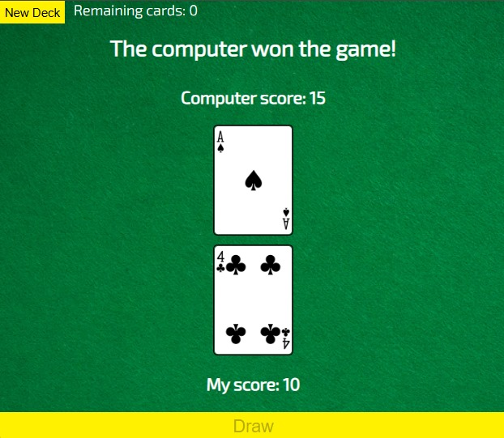
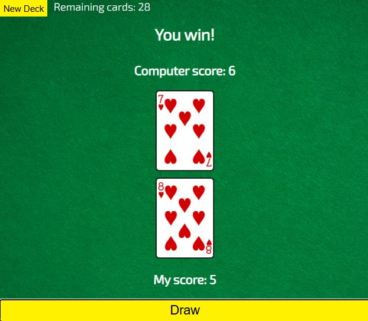

# ♠️ Card War 🃏

A simple card game built with **HTML, CSS, and JavaScript** using the [Deck of Cards API](https://deckofcardsapi.com/).  
Two players (you vs. the computer) draw cards from the same deck — the higher card wins the round, and the final winner is declared when the deck runs out.

 


---

## 🎮 Gameplay Rules

1. Click **"New Deck"** to shuffle and generate a fresh deck.
2. Click **"Draw Cards"** to deal 2 cards:
   - Left card = Computer’s card  
   - Right card = Your card
3. The player with the higher card value wins the round:
   - Ace is the highest, 2 is the lowest.
   - Face cards (Jack, Queen, King) rank above numbers.
4. Scores are tracked throughout the game.
5. When the deck runs out, the final winner is displayed at the top:
   - 🖥️ *Computer wins!*  
   - 🙋 *You win!*  
   - 🤝 *It’s a tie!*

---

## ✨ Features

- Fetches live cards from the **Deck of Cards API**.
- Dynamic score tracking (computer vs. player).
- Displays card images in real-time.
- Declares the **final winner** when all cards are drawn.
- Simple, responsive design.

---

## 🛠️ Installation & Setup

1. Clone the repository:
   ```bash
   git clone https://github.com/Shubhan9/Card-War.git
   cd Card-War
